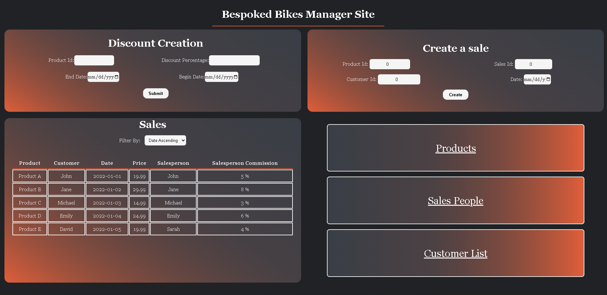
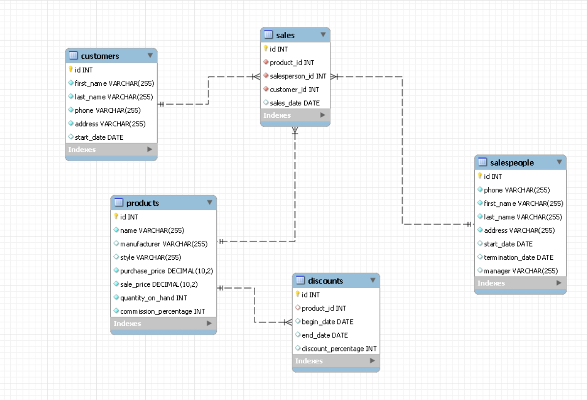

# BeSpoked-Bikes



- The application is split in two folder: client and server
- I will not assume you have Vue.js but you **will not need it**

## This application is built with
1. Client
   1. Vue3 (HTML, CSS, JS)
   2. Axios 1.4.0 (client-to-server connection)
   3. For You (no Vuejs): http-server 14.1.1

2. Server
   1. MySQL 8.0 Database
   2. Sequelize - 6.31.1
   3. Express JS - 4.18.2
   4. mysql2 - 3.3.1
   5. cors - 2.8.5
   6. body-parser - 1.20.2
   7. nodemon - 2.0.22

## Database



The script to create the **bespokedbikes** database and tables is in ***seederData.sql***
Run seederData.sql in your **MYSQL workbench** or **MySQL Command Line**
## Server

Visit ***dbInstance.js*** in the server folder and provide your **username** and **password** for your database

The server is ready to start and will restart if there are any changes

```
cd server
npm install
npm start
```

## Client

The client side has all the vue components which you will not need
You need the **dist** folder which is the completed version.

In the **terminal** run the following:

```
cd client
npm install
npm install -g http-server
cd dist
http-server
```

Use the following url http://127.0.0.1:8080 (2nd option)